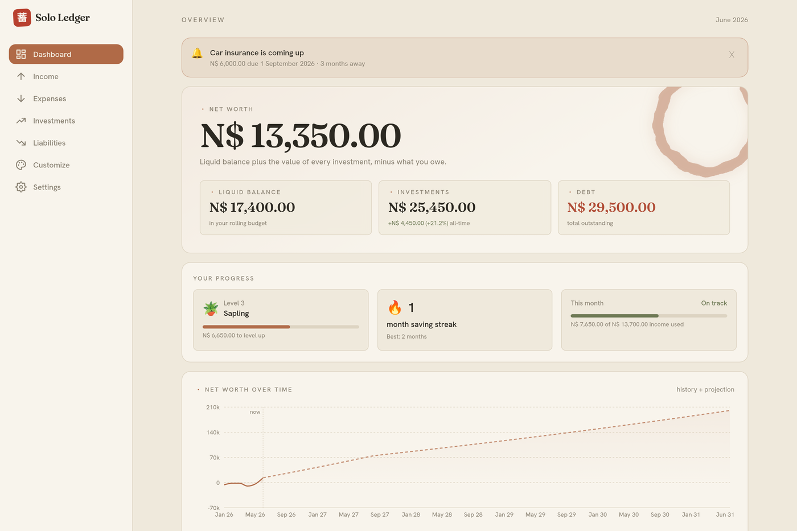
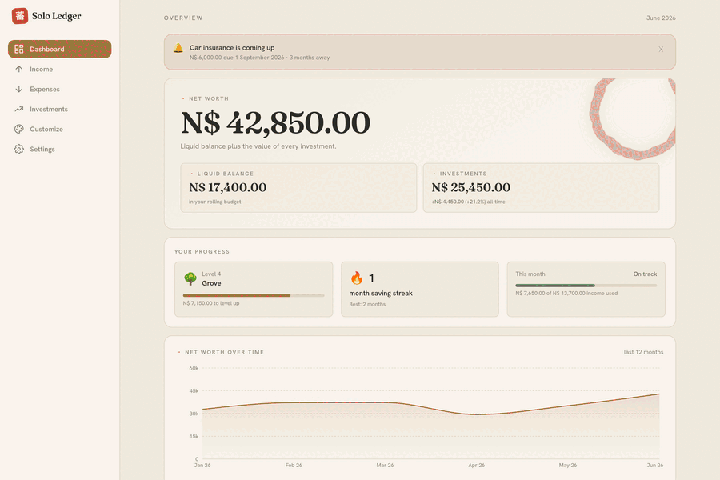

<div align="center">

# Solo Ledger

### A private, offline-first personal finance app. Your data never leaves your device.

[**▶ Live app**](https://solo-ledger-finance.netlify.app) · [Report a bug](https://github.com/xander-cloete/solo-ledger/issues) · [User guide (PDF)](tutorial/Solo-Ledger-User-Guide.pdf)

[](LICENSE)




</div>

## What it is

Solo Ledger keeps a running picture of your personal finances — what comes in, what goes
out, and what you're worth over time. The unusual part: it has **no account, no server,
and no cloud**. Everything you type is saved on your own device, in the browser's
database (IndexedDB). Close the tab and it's still there; nobody else ever sees it.

It's a **PWA**, so you can install it like a native app and it works fully offline.

> Built by a first-year Computer Science student, learning by shipping something real,
> paired with [Claude Code](https://claude.com/claude-code).

## Features

- **Rolling monthly ledger** — last month's leftover carries into the next, so every
  month opens with the right starting balance.
- **Net-worth tracking** — your liquid balance plus the value of every investment, charted
  across the last 12 months.
- **Income streams** — recurring sources that pre-fill each month; you only adjust what changed.
- **Three kinds of expense** — monthly, yearly (placed on its due month), and one-off,
  with optional itemising (qty × price, by store). The list stays focused on the month
  you're budgeting (with an all-time view a click away), and you edit each one inline.
- **Your view, your way** — on Income, Expenses and Investments, toggle which sections show
  and sort every list by name, amount or date. Your choices are remembered on your device.
- **Investments that tell the truth** — growth is separated from contributions, so deposits
  don't flatter your returns. 1-month / 3-month / 1-year and all-time figures.
- **Yearly-bill reminders** — a heads-up 3 months and/or 1 month before a big bill is due.
- **A quiet gamification layer** — a level that grows with your net worth, a saving streak,
  and a budget-used meter. Fully optional.
- **Backup & restore** — export everything to one JSON file, import it on a new device.
- **14 theme "worlds"** — see below.

## Fourteen themes

Each theme is a complete **world**, not a recoloured palette: its own type pairing, an
animated backdrop, a signature ornament on the dashboard, an app mark, and a bespoke
page-heading voice. Switching is instant and remembered on your device.



**Japandi** (brushed-ink ensō on washi paper · the default) · **Tokyo Night** (a starry
sky + crescent moon) · **Cyberpunk Noir** (a rain-slick, chromatically-split neon ring) ·
**Anime / Manga** (a crisp printed manga page — ink on paper, halftone screentone,
converging focus-lines and kira-kira sparkles) · **Art Deco** (a gilt sunburst on midnight
ink) · **Neoclassical** (a gold laurel on marble) · **Pixel Art** (a PC-98 dusk with a
blocky torii) · **Terminal** (a green CRT with an oscilloscope trace) · **Catppuccin
Latte** (pastel bokeh + a breathing cat) · **Clean** (sunlit editorial + a swaying sprig) ·
**Conceptual Sketch** (graphite drafting on graph paper) · **Bauhaus** (the red/yellow/blue
circle-triangle-square trio) · **Mixed Media** (a torn-paper + washi-tape collage) ·
**Utilitarian** (a Swiss-industrial registration target).

## Privacy

There's nothing to opt out of, because nothing is collected. All data lives in IndexedDB
under the database name `solo-ledger` (inspect it in **DevTools → Application → IndexedDB**).
Clearing your browser data wipes it — which is exactly why the in-app **Export backup** exists.

## Tech

Vite · React · TypeScript · Tailwind CSS (CSS-variable theming) · Dexie (IndexedDB) ·
react-router · Recharts · Framer Motion · self-hosted variable fonts (Fraunces +
Hanken Grotesk) · Zod (backup validation) · vite-plugin-pwa.

## Run it locally

This project uses **pnpm** (via corepack). If `pnpm` isn't found, enable it once:

```bash
corepack enable pnpm
```

Then, from the project folder:

```bash
pnpm install   # install dependencies (first time only)
pnpm dev       # start the dev server — open the printed http://localhost URL
pnpm build     # type-check + build the production bundle into dist/
pnpm preview   # preview the production build locally
```

Deploys are static: any host that serves the `dist/` folder works. This repo deploys to
Netlify automatically from `main` (see `netlify.toml`).

## Project layout

- `src/pages/` — the six screens (Dashboard, Income, Expenses, Investments, Customize, Settings)
- `src/db/` — the Dexie database and shared types
- `src/lib/` — the pure money logic (ledger, expenses, investments) kept free of UI
- `src/index.css` + `src/theme/themes.ts` — the theming system; per-theme decoration lives in
  `src/components/ThemeSignature.tsx` and `BrandMark.tsx`
- `tutorial/` — the screenshot → PDF user-guide pipeline
- `PROJECT_PLAN.md` — the full phase-by-phase build log

## License

[MIT](LICENSE) — free to use, modify and share. Built to be useful, not to make money.
